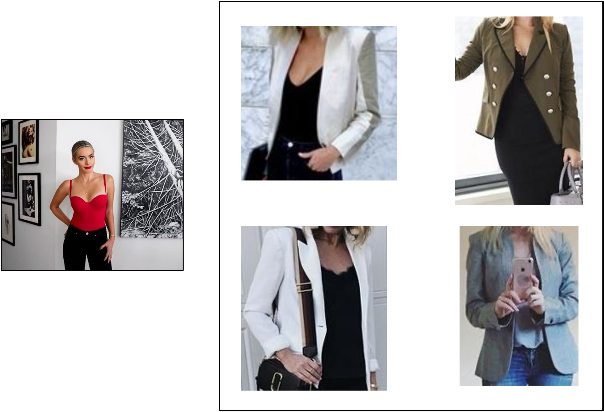
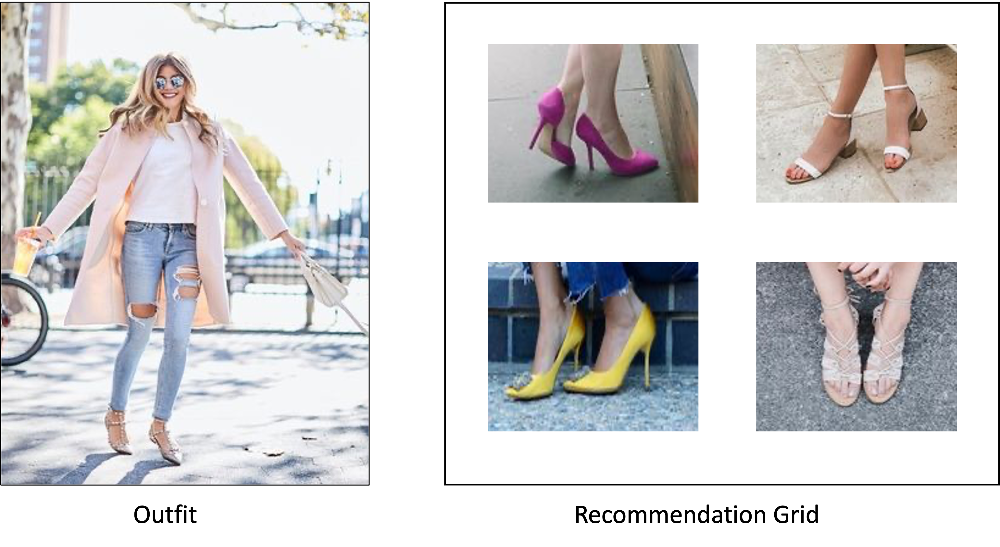
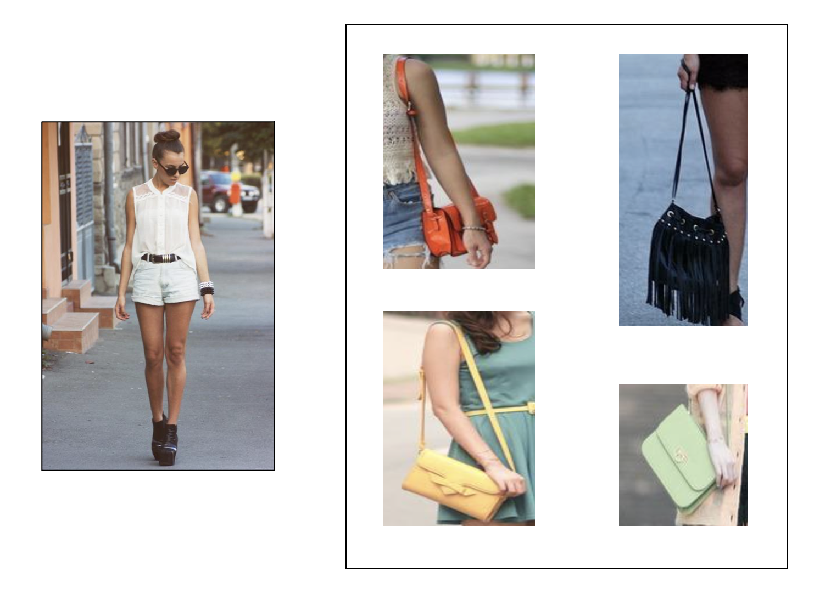
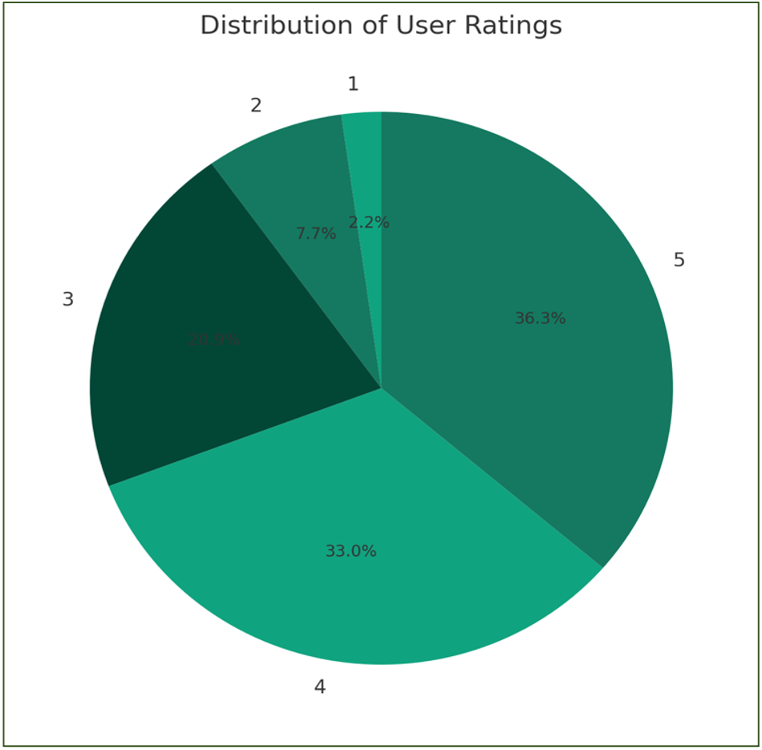

# Image-Based Fashion Recommender System

## Introduction

The global economy is significantly influenced by the fashion sector, with online fashion retailers playing a crucial role in shaping the market through their recommendation systems. However, traditional recommendation systems that rely on user data and semantic attributes are often inadequate in the fashion domain, where fashion compatibility is complex and subjective. This project proposes a novel approach to fashion recommendation systems by relying solely on image-based similarity algorithms. The goal is to suggest visually similar products and complete the look based on color palettes, textures, patterns, and shapes. The project is divided into three main task categories, namely object detection, visual similarity search, and product/outfit recommendation. The proposed system addresses computational challenges by employing ANNOY to reduce similarity search computation time. It also solves the challenge of evaluating the recommender system through user feedback surveys. The system aims to enhance customer experience by providing visually appealing recommendations. 

## Steps to Recreate Our fashion Recommender System

### Step 1: Dataset Curation
- The code to curate dataset is available in code/dataset_curation_yolov8.ipynb file.
- The required input datasets are 'colorful_fashion_images' and 'Pinterest' dataset which are both available at the provided drive link in dataset/Readme.md.
- The code downloads these images, preprocesses them and extract the products from outfits to create a link between outfits and products using YOLOv8 fine-tuned model. The mapping can also be seenn in the dataframe available at dataset/df_unique_final.csv.
- These extracted products and labeled images are also available at the drive link provided in dataset/Readme.md.

### Step 2: Complete the Look
- The code to run "Complete the Look Pipeline" is available in code/Complete_the_look.ipynb file.
- By using the dataset created in Step 1, ANNOY index is built to find the outfits most similar to any given query outfit.
- For a given outfit, the missing items/fashion products are identified automatically.
- The top N product recommendations are provided for the query outfit.
- The recommendations generated for 'colorful_fashion_images' and 'Pinterest' dataset are available at the provided drive link in dataset/Readme.md.

### Step 3: Evaluation
- The code to run the evaluation pipleine for each fashion label is available in code/evaluation/Evaluation_model_<fashion_label>.ipynb file.
- For each fashion label, the evaluation is performed separately.
- All recommendations generated for a particular outfit are comapred with the ground truth to find the cosine similarity between them.
- Such cosine similarity is calculated over all products for all labels such as shirts, jackets, pants, shoes and bags.

 
## Sample Recommendations

### Top Recommendation

### Jacket Recommendation

### Shoes Recommendation

### Bag Recommendation

### Complete the Look

## Survey Links

We created 5 different surveys to collect user feedback for our recommender system in order to evaluate the results. If you would like to share your feedback and help us improve this project, do take this survey. Thank you!

Survey 1: https://forms.gle/aKGi9KZPy8X29UwM9

Survey 2: https://shorturl.at/acqAM

Survey 3: https://forms.gle/rjMygAm9F6qU6phb9

Survey 4: https://shorturl.at/szFJL

Survey 5: https://forms.gle/qQM5rfuDeWaqwpSd9

Our current survey results show that ~70% users would cosinder our fashion recommender system for their future styling choices.

