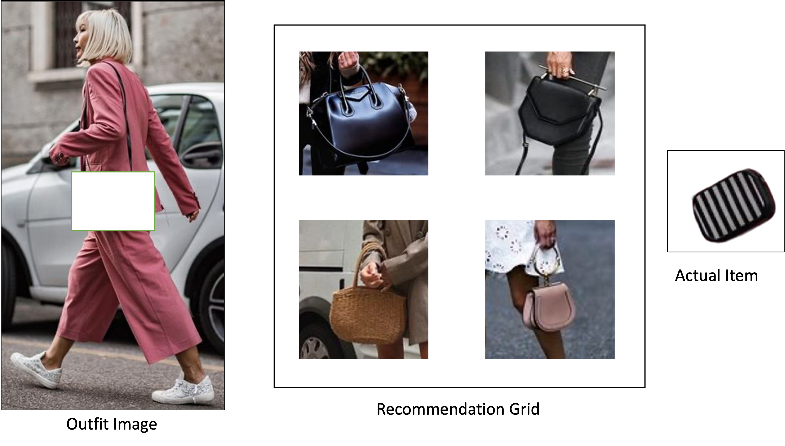

# Image-Based Fashion Recommender System

The global economy is significantly influenced by the fashion sector, with online fashion retailers playing a crucial role in shaping the market through their recommendation systems. However, traditional recommendation systems that rely on user data and semantic attributes are often inadequate in the fashion domain, where fashion compatibility is complex and subjective. This project proposes a novel approach to fashion recommendation systems by relying solely on image-based similarity algorithms. The goal is to suggest visually similar products and complete the look based on color palettes, textures, patterns, and shapes. The project is divided into three main task categories, namely object detection, visual similarity search, and product/outfit recommendation. The proposed system addresses computational challenges by employing ANNOY to reduce similarity search computation time. It also solves the challenge of evaluating the recommender system through user feedback surveys. The system aims to enhance customer experience by providing visually appealing recommendations. 

Some sample recommendations generated by our fashion recoomender system:  

